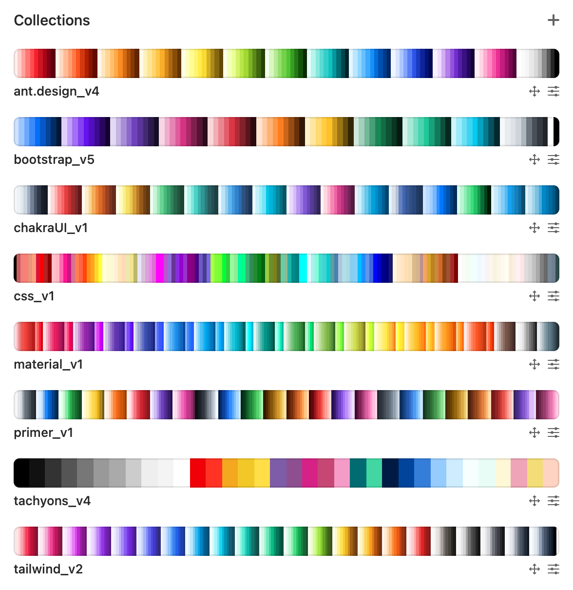

# 🌈 Apple CLR Palettes

## What?

These are CLR colour palettes you can directly load into your apple colorpicker tool.



| Colour Palette     | Official Link                                                 |
| ------------------ | ------------------------------------------------------------ |
| TailwindCSS v2     | [tailwindcss.com](https://tailwindcss.com/docs/customizing-colors)              |
| Google Material Design v1 | [material.io](https://material.io/design/color/the-color-system.html#tools-for-picking-colors) |
| Bootstrap v5       | [getbootstrap.com](https://getbootstrap.com/docs/5.0/customize/color/)           |
| Chakra-UI v1       | [chakra-ui.com](https://chakra-ui.com/) |
| W3C CSS v1         | [w3.org](https://www.w3.org/wiki/CSS/Properties/color/keywords) |
| Ant.Design v4      | [Ant.Design](https://ant.design/docs/spec/colors) |
| Tachyons v4        | [Tachyons.io](https://tachyons.io/#principles) |
| Github Primer v1   | [Primer.style](https://primer.style/css/support/color-system) |
| Copic v1           | [Copic.jp](https://copic.jp/en/color/) |
| Pantone-coated v1  | [Pantone.com](https://www.pantone.com/uk/en/topic/swatches-chips-sheets) |
| Pantone-metalic v1  | [Pantone.com](https://www.pantone.com/uk/en/topic/swatches-chips-sheets) |
| Pantone-pastel-neon v1  | [Pantone.com](https://www.pantone.com/uk/en/topic/swatches-chips-sheets) |
| Pantone-skin v1  | [Pantone.com](https://www.pantone.com/uk/en/topic/swatches-chips-sheets) |
| Pantone-uncoated v1  | [Pantone.com](https://www.pantone.com/uk/en/topic/swatches-chips-sheets) |
| Pantone-fashion-interiors v1  | [Pantone.com](https://www.pantone.com/uk/en/topic/swatches-chips-sheets) |
| Crayola v1 | [Crayola.co.uk](http://www.crayola.co.uk/) |


## Install

Open terminal and run:
```
cd $HOME/Downloads && git clone https://github.com/IORoot/macos__colorpicker--palettes.git
```
This will download this repo into your home /Downloads folder.

Load any palette into any supporting Apple CLR software. (Default apple color-picker, colorslurp, etc...)


## Usage

You can install this file into your apple color-picker by running the colourpicker and selecting the following options:

```
colourpicker > Colour Palettes > (...) circle icon with three dots > open
```

## Import into Apple colorpicker panel

**Note** that you can only access the official apple macos colorpicker tool through a different program like 'apple photos', 'sketch', 'photoshop', etc..

If you wish to directly open the colorpicker tool as it's own application, see my other project that does exactly that:
https://github.com/IORoot/macos__colorpicker--app


## Create your own!

Using my json-to-clr tool you can create any Apple CLR tools you wish. 
https://github.com/IORoot/macos__json2clr--convert

## Submit your own!
Create a pull-request if you want to add any other official colour palettes.


## Changelog

0.0.12 - Crayola v1

0.0.11 - Pantone-fashion-interiors v1

0.0.10 - Pantone-coated, Pantone-metalic, Pantone-pastel-neon, Pantone-skin, Pantone-uncoated

0.0.9 - Copic Color v1

0.0.8 - Github Primer v1

0.0.7 - Tachyons v4

0.0.6 - Ant.Design v4

0.0.5 - W3C CSS v1

0.0.4 - Chakra-UI v1

0.0.3 - Bootstrap v5

0.0.2 - Material Palette v1

0.0.1 - Inital bundle. TailwindCSS v2 Palette.